# Arquitetura do Sistema - Análise de Chats com IA e Pagamento Premium (Atualizado 12/04/2025)

---

## Visão Geral

O sistema é uma aplicação web robusta e moderna, projetada para permitir que usuários analisem seus chats do WhatsApp de forma detalhada e inteligente. Utilizando técnicas avançadas de Processamento de Linguagem Natural (NLP) e Inteligência Artificial (IA), a aplicação extrai insights valiosos e apresenta visualizações ricas sobre os padrões de comunicação.

**Funcionalidades Principais:**

- **Análise Detalhada de Chats:**  Transforma dados brutos de chats do WhatsApp em informações estruturadas e insights acionáveis.
- **NLP e IA Aplicadas:** Utiliza técnicas de NLP para análise de sentimentos, identificação de padrões de linguagem e extração de entidades. A IA, impulsionada pelo Google Gemini, oferece análises contextuais avançadas e recursos premium.
- **Visualizações Interativas:** Apresenta os resultados da análise através de gráficos dinâmicos, nuvens de emojis, heatmaps de atividade e outros componentes visuais intuitivos.
- **Funcionalidades Premium:** Oferece recursos avançados para usuários premium, como análises preditivas, poemas personalizados, análise de estilo de escrita e identificação de "red flags" e "green flags" em conversas.
- **Pagamento Integrado:** Sistema de pagamento via Mercado Pago, suportando cartão de crédito e Pix, para acesso facilitado às funcionalidades premium.
- **Backend Serverless:**  Arquitetura backend serverless utilizando Firebase Functions, garantindo escalabilidade, segurança e baixo custo de manutenção.
- **Persistência de Dados:** Utilização do Firestore para armazenamento eficiente e seguro dos dados de análise e informações de usuários premium.

**Público-Alvo:**

- Usuários curiosos sobre seus padrões de comunicação em chats.
- Pessoas interessadas em obter insights sobre dinâmicas de conversas pessoais ou em grupo.
- Usuários que buscam ferramentas para análise de sentimentos e padrões de linguagem em seus chats.

---

## Diagrama Geral (Mermaid)

```mermaid
flowchart TD
    subgraph "User Interface (Frontend - React + Vite)"
        direction LR

        subgraph "Pages (src/pages)"
            WelcomePage["WelcomePage.tsx"]
            InstructionsPage["InstructionsPage.tsx"]
            AnalyzingPage["AnalyzingPage.tsx"]
            ResultsPage["ResultsPage.tsx"]
            PremiumPage["PremiumPage.tsx"]
            PaymentPage["PaymentPage.tsx"]
            ReceiveSharePage["ReceiveSharePage.tsx"]
            AboutPage["About.tsx"]
            PrivacyPolicyPage["PrivacyPolicy.tsx"]
            TermsOfUsePage["TermsOfUse.tsx"]
            NotFoundPage["NotFound.tsx"]
            IndexPage["Index.tsx (Router & Layout)"]
        end

        subgraph "Core Logic & State"
            ChatAnalysisProvider["ChatAnalysisContext.tsx\n(Provider)"]
            useChatAnalysis["useChatAnalysis\n(Hook)"]
            parseChat["parseChat.ts\n(Lib)"]
            analyzeChat["analyzeChat.ts\n(Lib)"]
        end

        subgraph "UI Components (src/components)"
            ResultComponents["Result Components\n(EmojiCloud, TimelineChart, etc.)"]
            PremiumComponents["Premium Components\n(CrystalBall, etc.)"]
            CommonUI["Common UI\n(Button, Card, etc. - src/components/ui)"]
            LayoutComponents["Layout Components\n(GradientBackground, Logo, etc.)"]
        end

        subgraph "Hooks (src/hooks)"
            useIsMobile["use-mobile.tsx"]
            useAppToast["use-toast.ts"]
        end

        %% Fluxo Principal
        IndexPage --> WelcomePage
        WelcomePage --> InstructionsPage
        InstructionsPage -- Upload Chat --> parseChat
        parseChat -- Parsed Messages --> analyzeChat
        analyzeChat -- Analysis Results --> ChatAnalysisProvider
        ChatAnalysisProvider -- Update Context --> AnalyzingPage
        AnalyzingPage -- Analysis Complete --> ResultsPage

        %% Navegação e Acesso a Dados
        ResultsPage -- Access Context --> useChatAnalysis
        PremiumPage -- Access Context --> useChatAnalysis
        PaymentPage -- Access Context --> useChatAnalysis

        ResultsPage -- Usa --> ResultComponents
        ResultsPage -- Usa --> CommonUI
        ResultsPage -- Usa --> LayoutComponents
        ResultsPage -- Usa Hooks --> useIsMobile & useAppToast
        ResultsPage --> PremiumPage
        ResultsPage --> PaymentPage

        PremiumPage -- Usa --> PremiumComponents
        PremiumPage -- Usa --> ResultComponents
        PremiumPage -- Usa --> CommonUI
        PremiumPage -- Usa --> LayoutComponents
        PremiumPage -- Usa Hooks --> useIsMobile & useAppToast
        PremiumPage --> PaymentPage

        PaymentPage -- Usa --> CommonUI
        PaymentPage -- Usa --> LayoutComponents
        PaymentPage -- Usa Hooks --> useIsMobile & useAppToast

        %% Outras Páginas
        IndexPage --> AboutPage
        IndexPage --> PrivacyPolicyPage
        IndexPage --> TermsOfUsePage
        IndexPage --> ReceiveSharePage
        IndexPage --> NotFoundPage

        %% Componentes Gerais
        ResultComponents -- Dependem de --> CommonUI
        PremiumComponents -- Dependem de --> CommonUI
    end

    subgraph "Backend (Firebase Functions - Node.js/TypeScript)"
        direction LR
        callGemini["callGemini.ts\n(Google Gemini API)"]
        saveAnalysisResults["saveAnalysisResults.ts\n(Firestore Write)"]
        getAnalysisResults["getAnalysisResults.ts\n(Firestore Read)"]
        createPayment["createPayment.ts\n(Mercado Pago Card API)"]
        createPixPayment["createPixPayment.ts\n(Mercado Pago Pix API)"]
        handlePixWebhook["handlePixWebhook.ts\n(Mercado Pago Webhook)"]
    end

    subgraph "External Services & Database"
        direction LR
        MercadoPago["Mercado Pago API"]
        GoogleGemini["Google Gemini API"]
        FirestoreDB["Firestore Database\n(Analysis Data, Premium Status, Payment Info)"]
    end

    %% Frontend -> Backend Interactions
    ResultsPage -- Chama IA --> callGemini
    PremiumPage -- Chama IA --> callGemini
    PremiumPage -- Salva Análise --> saveAnalysisResults
    ResultsPage -- Obtém Análise --> getAnalysisResults
    ReceiveSharePage -- Obtém Análise --> getAnalysisResults

    PaymentPage -- Processa Cartão --> createPayment
    PaymentPage -- Gera Pix QR --> createPixPayment

    %% Backend -> External Services Interactions
    callGemini --> GoogleGemini
    createPayment --> MercadoPago
    createPixPayment --> MercadoPago
    handlePixWebhook -- Recebe Notificação --> MercadoPago

    %% Backend -> Database Interactions
    saveAnalysisResults --> FirestoreDB
    getAnalysisResults --> FirestoreDB
    createPayment -- Atualiza Status --> FirestoreDB
    createPixPayment -- Salva Info Pagamento --> FirestoreDB
    handlePixWebhook -- Atualiza Status Premium --> FirestoreDB

    %% External -> Backend Interactions
    MercadoPago -- Envia Webhook Pix --> handlePixWebhook

    %% Estilos (Opcional, apenas para clareza)
    classDef frontend fill:#f9f,stroke:#333,stroke-width:2px;
    classDef backend fill:#ccf,stroke:#333,stroke-width:2px;
    classDef external fill:#cfc,stroke:#333,stroke-width:2px;
    classDef pages fill:#eef,stroke:#99d,stroke-width:1px;
    classDef logic fill:#ffe,stroke:#ddc,stroke-width:1px;
    classDef components fill:#eff,stroke:#dee,stroke-width:1px;
    classDef hooks fill:#fee,stroke:#edd,stroke-width:1px;

    class WelcomePage,InstructionsPage,AnalyzingPage,ResultsPage,PremiumPage,PaymentPage,ReceiveSharePage,AboutPage,PrivacyPolicyPage,TermsOfUsePage,NotFoundPage,IndexPage pages;
    class ChatAnalysisProvider,useChatAnalysis,parseChat,analyzeChat logic;
    class ResultComponents,PremiumComponents,CommonUI,LayoutComponents components;
    class useIsMobile,useAppToast hooks;
    class callGemini,saveAnalysisResults,getAnalysisResults,createPayment,createPixPayment,handlePixWebhook backend;
    class MercadoPago,GoogleGemini,FirestoreDB external;

    class User_Interface_Frontend_React_Vite frontend;
    class Backend_Firebase_Functions_Node_js_TypeScript backend;
    class External_Services_Database external;

    subgraph User_Interface_Frontend_React_Vite ["User Interface (Frontend - React + Vite)"]
        direction LR
        subgraph Pages ["Pages (src/pages)"]
            WelcomePage["WelcomePage.tsx"]
            InstructionsPage["InstructionsPage.tsx"]
            AnalyzingPage["AnalyzingPage.tsx"]
            ResultsPage["ResultsPage.tsx"]
            PremiumPage["PremiumPage.tsx"]
            PaymentPage["PaymentPage.tsx"]
            ReceiveSharePage["ReceiveSharePage.tsx"]
            AboutPage["About.tsx"]
            PrivacyPolicyPage["PrivacyPolicy.tsx"]
            TermsOfUsePage["TermsOfUse.tsx"]
            NotFoundPage["NotFound.tsx"]
            IndexPage["Index.tsx (Router & Layout)"]
        end
        subgraph Core_Logic_State ["Core Logic & State"]
             ChatAnalysisProvider["ChatAnalysisContext.tsx\n(Provider)"]
             useChatAnalysis["useChatAnalysis\n(Hook)"]
             parseChat["parseChat.ts\n(Lib)"]
             analyzeChat["analyzeChat.ts\n(Lib)"]
        end
        subgraph UI_Components ["UI Components (src/components)"]
             ResultComponents["Result Components\n(EmojiCloud, TimelineChart, etc.)"]
             PremiumComponents["Premium Components\n(CrystalBall, etc.)"]
             CommonUI["Common UI\n(Button, Card, etc. - src/components/ui)"]
             LayoutComponents["Layout Components\n(GradientBackground, Logo, etc.)"]
        end
         subgraph Hooks ["Hooks (src/hooks)"]
             useIsMobile["use-mobile.tsx"]
             useAppToast["use-toast.ts"]
         end
         %% Connections within Frontend... (keep existing connections)
        IndexPage --> WelcomePage
        WelcomePage --> InstructionsPage
        InstructionsPage -- Upload Chat --> parseChat
        parseChat -- Parsed Messages --> analyzeChat
        analyzeChat -- Analysis Results --> ChatAnalysisProvider
        ChatAnalysisProvider -- Update Context --> AnalyzingPage
        AnalyzingPage -- Analysis Complete --> ResultsPage
        ResultsPage -- Access Context --> useChatAnalysis
        PremiumPage -- Access Context --> useChatAnalysis
        PaymentPage -- Access Context --> useChatAnalysis
        ResultsPage -- Usa --> ResultComponents
        ResultsPage -- Usa --> CommonUI
        ResultsPage -- Usa --> LayoutComponents
        ResultsPage -- Usa Hooks --> useIsMobile & useAppToast
        ResultsPage --> PremiumPage
        ResultsPage --> PaymentPage
        PremiumPage -- Usa --> PremiumComponents
        PremiumPage -- Usa --> ResultComponents
        PremiumPage -- Usa --> CommonUI
        PremiumPage -- Usa --> LayoutComponents
        PremiumPage -- Usa Hooks --> useIsMobile & useAppToast
        PremiumPage --> PaymentPage
        PaymentPage -- Usa --> CommonUI
        PaymentPage -- Usa --> LayoutComponents
        PaymentPage -- Usa Hooks --> useIsMobile & useAppToast
        IndexPage --> AboutPage
        IndexPage --> PrivacyPolicyPage
        IndexPage --> TermsOfUsePage
        IndexPage --> ReceiveSharePage
        IndexPage --> NotFoundPage
        ResultComponents -- Dependem de --> CommonUI
        PremiumComponents -- Dependem de --> CommonUI
    end

    subgraph Backend_Firebase_Functions_Node_js_TypeScript ["Backend (Firebase Functions - Node.js/TypeScript)"]
        direction LR
        callGemini["callGemini.ts\n(Google Gemini API)"]
        saveAnalysisResults["saveAnalysisResults.ts\n(Firestore Write)"]
        getAnalysisResults["getAnalysisResults.ts\n(Firestore Read)"]
        createPayment["createPayment.ts\n(Mercado Pago Card API)"]
        createPixPayment["createPixPayment.ts\n(Mercado Pago Pix API)"]
        handlePixWebhook["handlePixWebhook.ts\n(Mercado Pago Webhook)"]
    end

    subgraph External_Services_Database ["External Services & Database"]
        direction LR
        MercadoPago["Mercado Pago API"]
        GoogleGemini["Google Gemini API"]
        FirestoreDB["Firestore Database\n(Analysis Data, Premium Status, Payment Info)"]
    end

    %% Connections between subgraphs... (keep existing connections)
    ResultsPage -- Chama IA --> callGemini
    PremiumPage -- Chama IA --> callGemini
    PremiumPage -- Salva Análise --> saveAnalysisResults
    ResultsPage -- Obtém Análise --> getAnalysisResults
    ReceiveSharePage -- Obtém Análise --> getAnalysisResults
    PaymentPage -- Processa Cartão --> createPayment
    PaymentPage -- Gera Pix QR --> createPixPayment
    callGemini --> GoogleGemini
    createPayment --> MercadoPago
    createPixPayment --> MercadoPago
    handlePixWebhook -- Recebe Notificação --> MercadoPago
    saveAnalysisResults --> FirestoreDB
    getAnalysisResults --> FirestoreDB
    createPayment -- Atualiza Status --> FirestoreDB
    createPixPayment -- Salva Info Pagamento --> FirestoreDB
    handlePixWebhook -- Atualiza Status Premium --> FirestoreDB
    MercadoPago -- Envia Webhook Pix --> handlePixWebhook

    %% Style definitions... (keep existing classDefs)
    classDef frontend fill:#f9f,stroke:#333,stroke-width:2px;
    classDef backend fill:#ccf,stroke:#333,stroke-width:2px;
    classDef external fill:#cfc,stroke:#333,stroke-width:2px;
    classDef pages fill:#eef,stroke:#99d,stroke-width:1px;
    classDef logic fill:#ffe,stroke:#ddc,stroke-width:1px;
    classDef components fill:#eff,stroke:#dee,stroke-width:1px;
    classDef hooks fill:#fee,stroke:#edd,stroke-width:1px;

    %% Assign classes to nodes... (keep existing assignments)
    class WelcomePage,InstructionsPage,AnalyzingPage,ResultsPage,PremiumPage,PaymentPage,ReceiveSharePage,AboutPage,PrivacyPolicyPage,TermsOfUsePage,NotFoundPage,IndexPage pages;
    class ChatAnalysisProvider,useChatAnalysis,parseChat,analyzeChat logic;
    class ResultComponents,PremiumComponents,CommonUI,LayoutComponents components;
    class useIsMobile,useAppToast hooks;
    class callGemini,saveAnalysisResults,getAnalysisResults,createPayment,createPixPayment,handlePixWebhook backend;
    class MercadoPago,GoogleGemini,FirestoreDB external;

    %% Assign classes to subgraph IDs
    class User_Interface_Frontend_React_Vite frontend;
    class Backend_Firebase_Functions_Node_js_TypeScript backend;
    class External_Services_Database external;
```

## Fluxo Detalhado do Usuário

1. **WelcomePage**: O usuário acessa a aplicação e é recebido com uma tela de boas-vindas, apresentando o propósito da ferramenta e seus principais benefícios.
2. **InstructionsPage**: O usuário é direcionado para a página de instruções, onde encontra orientações claras sobre como exportar o chat do WhatsApp em formato .txt e realizar o upload na aplicação.
3. **Parsing (`parseChat.ts`)**: Ao realizar o upload, o arquivo `parseChat.ts` entra em ação. Este módulo é responsável por:
    - **Leitura e Interpretação do Arquivo:** Lê o arquivo .txt do chat, independentemente do formato (WhatsApp padrão, exports de terceiros, etc.).
    - **Estruturação das Mensagens:** Transforma o texto bruto em objetos `ParsedMessage`, que contêm `timestamp`, `sender` e `message`, facilitando o processamento posterior.
    - **Tratamento de Casos Especiais:** Lida com mensagens multi-linhas, mensagens de sistema do WhatsApp e placeholders de mídia (imagens, vídeos, áudios), garantindo que a análise seja robusta e precisa.
4. **Análise (`analyzeChat.ts`)**: Após o parsing, o módulo `analyzeChat.ts` executa uma série de análises estatísticas e de NLP:
    - **Estatísticas Básicas:** Calcula contagem de mensagens, emojis, palavras, caracteres, links, mídias, etc.
    - **Análise de Sentimentos:** Utiliza bibliotecas de NLP para determinar o sentimento geral das mensagens (positivo, negativo, neutro) e identificar palavras-chave associadas a cada sentimento.
    - **Padrões de Comunicação:** Identifica horários de pico de atividade, dias da semana mais ativos, tempo médio de resposta entre os remetentes e outras métricas relevantes.
    - **Bigramas e Expressões Frequentes:** Extrai os bigramas (pares de palavras) mais comuns e outras expressões linguísticas relevantes para entender os temas e padrões da conversa.
    - **Recursos Premium (Opcional):** Para usuários premium, executa análises adicionais, como identificação de passivo-agressividade, flerte, red flags e green flags, utilizando modelos de IA e regras de NLP mais complexas.
5. **Contexto Global (`ChatAnalysisContext`)**: Os resultados da análise são armazenados no `ChatAnalysisContext`, um contexto global React gerenciado por `ChatAnalysisProvider` e acessível via `useChatAnalysis` hook. Isso garante que os dados da análise estejam disponíveis em toda a aplicação de forma eficiente.
6. **AnalyzingPage**: Enquanto a análise é processada, o usuário é direcionado para a `AnalyzingPage`, que exibe uma tela de carregamento amigável, informando sobre o progresso da análise.
7. **ResultsPage**: Ao término da análise, a `ResultsPage` é renderizada, exibindo os resultados de forma clara e organizada. Esta página utiliza diversos componentes visuais (listados abaixo) para apresentar os insights extraídos do chat.
8. **PremiumPage**: A `PremiumPage` oferece uma prévia dos recursos premium disponíveis, como análises avançadas de IA (previsão de tendências, poemas personalizados, análise de estilo de escrita, CrystalBall, etc.). Usuários podem ser direcionados para esta página a partir da `ResultsPage` para explorar os benefícios da versão premium.
9. **PaymentPage**: Ao optar por adquirir a versão premium, o usuário é levado à `PaymentPage`. Esta página integra o SDK do Mercado Pago para processamento de pagamentos.
    - **Pagamento com Cartão:** O frontend utiliza o SDK do Mercado Pago para tokenizar os dados do cartão de crédito de forma segura e envia um token para a Cloud Function `/create-payment`. A Cloud Function processa o pagamento, atualiza o status do usuário no Firestore para premium e retorna o status do pagamento para o frontend.
    - **Pagamento com Pix:** O frontend solicita a geração de um QR Code Pix através da Cloud Function `/createPixPayment`. A Cloud Function gera o QR Code, salva as informações de pagamento no Firestore e retorna o QR Code para o frontend. Após o pagamento via Pix, o Mercado Pago envia um webhook (`handlePixWebhook`) para o backend, confirmando o pagamento. O backend valida o webhook, atualiza o status do usuário para premium no Firestore e notifica o frontend sobre a aprovação do pagamento.
10. **Backend (Firebase Functions)**: As Cloud Functions no backend são responsáveis por:
    - **`callGemini`**: Integração com a API do Google Gemini para funcionalidades de IA, como geração de texto criativo, análise de estilo de escrita e análise de personalidade.
    - **`saveAnalysisResults`**: Persiste os resultados da análise no Firestore, associando-os ao usuário (anonimizado ou autenticado, dependendo da implementação).
    - **`getAnalysisResults`**: Recupera os resultados da análise do Firestore para exibição na `ResultsPage` e `PremiumPage`.
    - **`createPayment`**: Processa pagamentos com cartão de crédito via Mercado Pago, utilizando as APIs do Mercado Pago e as credenciais armazenadas de forma segura no backend.
    - **`createPixPayment`**: Gera QR Codes Pix para pagamentos via Pix, utilizando as APIs do Mercado Pago.
    - **`handlePixWebhook`**: Recebe e processa webhooks do Mercado Pago para confirmação de pagamentos Pix. Valida a assinatura do webhook para garantir a autenticidade da notificação e atualiza o status do usuário para premium no Firestore.

---

## Componentes Principais Detalhados

- **Contexto Global (`src/context`)**
    - **`ChatAnalysisProvider`**: Componente React Provider que envolve a aplicação e disponibiliza o contexto global de análise de chat.
    - **`useChatAnalysis`**: Hook React que permite acessar e atualizar o estado do `ChatAnalysisContext` em qualquer componente da aplicação. O contexto gerencia:
        - `rawChatText`: Texto bruto do chat uploaded.
        - `parsedMessages`: Array de mensagens parseadas (`ParsedMessage[]`).
        - `analysisResults`: Objeto contendo os resultados da análise (`AnalysisResults`).
        - `isLoading`: Flag indicando se a análise está em andamento.
        - `error`: Mensagem de erro, caso ocorra algum problema durante a análise.
        - `isPremium`: Flag indicando se o usuário possui status premium.
        - Dados gerados por IA (previsões, poemas, análises de estilo, etc.).
        - Estado de componentes de visualização (view selecionada, sender focado, etc.).

- **Libs (`src/lib`)**
    - **`parseChat.ts`**: Biblioteca para parsing de chats, responsável por transformar o texto bruto em dados estruturados (`ParsedMessage[]`).
    - **`analyzeChat.ts`**: Biblioteca para análise de chats, contendo funções para realizar análises estatísticas, NLP e de IA (`AnalysisResults`).

- **Hooks (`src/hooks`)**
    - **`useIsMobile`**: Hook para detectar se o usuário está acessando a aplicação em um dispositivo móvel, permitindo ajustes na interface e experiência do usuário.
    - **`useToast`**: Hook para gerenciamento de notificações toast (mensagens rápidas e discretas na tela), utilizado para feedback ao usuário sobre ações na aplicação.

- **Componentes Visuais (`src/components` e `src/ui`)**
    - **Componentes de Resultados:**
        - `SenderFocus`: Destaca informações e estatísticas de um remetente específico.
        - `ResultCard`: Exibe um card com um resultado chave da análise (ex: total de mensagens, emoji mais usado).
        - `ContactBubble`: Representação visual dos remetentes do chat.
        - `EmojiCloud`: Nuvem de emojis mais frequentes no chat.
        - `TimelineChart`: Gráfico de linha do tempo mostrando a atividade do chat ao longo do tempo.
        - `SentimentChart`: Gráfico de pizza ou barra mostrando a distribuição de sentimentos nas mensagens.
        - `ShareableImage`: Componente para gerar imagens compartilháveis dos resultados da análise.
        - `ActivityHeatmap`: Heatmap visualizando a atividade do chat em diferentes horários e dias da semana.
        - `CrystalBall`: Componente premium para exibir previsões e insights gerados por IA.
        - `AdBanner`: Banner de propaganda (pode ser utilizado para promover a versão premium ou outros serviços).
        - `AnimatedText`: Componente para exibir texto animado (ex: mensagens de boas-vindas, loading).
        - `StepIndicator`: Indicador visual de progresso em etapas (ex: upload, parsing, análise).
        - `FloatingEmoji`: Emojis flutuantes e animados para feedback visual.
        - `GradientBackground`: Componente para aplicar fundos gradientes à aplicação.
        - `Logo`: Logo da aplicação.
    - **Componentes de UI Reutilizáveis (`src/ui`)**: Componentes de interface do usuário genéricos e reutilizáveis, como botões, inputs, modais, etc., construídos com bibliotecas como Tailwind CSS e Radix UI.

- **Páginas (`src/pages`)**
    - `WelcomePage`: Tela inicial de boas-vindas.
    - `InstructionsPage`: Página com instruções de upload do chat.
    - `AnalyzingPage`: Tela de carregamento durante a análise.
    - `ResultsPage`: Exibição dos resultados da análise.
    - `PremiumPage`: Página de apresentação dos recursos premium.
    - `PaymentPage`: Integração com o Mercado Pago para pagamentos.
    - `NotFound`: Página de erro 404.
    - `PrivacyPolicy`: Página com a política de privacidade da aplicação.
    - `About`: Página "Sobre" a aplicação e seus desenvolvedores.
    - `ReceiveSharePage`: Página para receber e exibir análises compartilhadas.
    - `Index`: Página principal da aplicação, responsável pelo roteamento e layout geral.

- **Backend Firebase (`functions/src`)**
    - `callGemini.ts`: Cloud Function para integração com a API Google Gemini.
    - `saveAnalysisResults.ts`: Cloud Function para salvar resultados da análise no Firestore.
    - `getAnalysisResults.ts`: Cloud Function para recuperar resultados da análise do Firestore.
    - `createPayment.ts`: Cloud Function para processar pagamentos com cartão via Mercado Pago.
    - `createPixPayment.ts`: Cloud Function para gerar QR Codes Pix para pagamento.
    - `handlePixWebhook.ts`: Cloud Function para processar webhooks de pagamento Pix do Mercado Pago.

- **Firestore (`Firebase`)**
    - Banco de dados NoSQL para persistência de dados:
        - Resultados de análises de chat.
        - Status de usuários premium.
        - Informações de pagamentos (transações, status, etc.).
        - Configurações da aplicação.

---

## Integrações Externas Detalhadas

- **Firebase (Google Firebase)**
    - **Autenticação Firebase:** (Opcional) Para gerenciar usuários autenticados e personalizar a experiência.
    - **Firestore:** Banco de dados NoSQL para armazenamento de dados da aplicação.
    - **Firebase Functions:** Plataforma serverless para executar o backend da aplicação, processar pagamentos, integrar com APIs externas e executar lógica de negócios.
    - **Firebase Hosting:** Para hospedar o frontend da aplicação web de forma rápida e escalável.

- **Mercado Pago (Mercado Pago)**
    - **Mercado Pago SDK (Frontend):** Para integrar o formulário de pagamento com cartão de crédito de forma segura no frontend.
    - **APIs Mercado Pago (Backend):** Para processar pagamentos com cartão e Pix, gerar QR Codes Pix e receber webhooks de confirmação de pagamento.

- **Google Gemini (Google AI)**
    - **API Google Gemini (Backend):** Para funcionalidades de inteligência artificial, como análise de sentimentos avançada, geração de texto criativo (poemas), análise de estilo de escrita e outras funcionalidades premium.

---

## Segurança em Detalhe

A segurança é uma prioridade máxima na arquitetura do sistema. As seguintes medidas de segurança são implementadas:

- **Segurança no Frontend:**
    - **Tokenização Segura de Cartões:** Utilização do SDK do Mercado Pago para tokenizar os dados de cartão de crédito diretamente no frontend, sem que informações sensíveis sejam armazenadas ou trafeguem pelos servidores da aplicação.
    - **HTTPS em Todas as Comunicações:** Todas as comunicações entre o frontend e o backend são realizadas via HTTPS, garantindo a criptografia dos dados em trânsito.
    - **Prevenção de XSS e CSRF:** Utilização de frameworks React e configurações de segurança para mitigar vulnerabilidades comuns como Cross-Site Scripting (XSS) e Cross-Site Request Forgery (CSRF).

- **Segurança no Backend (Firebase Functions):**
    - **Credenciais Seguras:** As credenciais de acesso às APIs do Mercado Pago e Google Gemini são armazenadas de forma segura no ambiente de variáveis de ambiente do Firebase Functions, evitando a exposição no código fonte.
    - **Validação de Webhooks:** O webhook de confirmação de pagamento Pix do Mercado Pago (`handlePixWebhook`) implementa validação de assinatura utilizando um `MERCADO_PAGO_WEBHOOK_SECRET` armazenado de forma segura. Isso garante que apenas notificações legítimas do Mercado Pago sejam processadas.
    - **Atualização Segura do Status Premium:** A lógica para atualizar o status premium do usuário (`isPremiumAnalysis`) é executada exclusivamente no backend, após a confirmação de pagamento via webhook ou processamento de pagamento com cartão. O frontend **nunca** tem permissão para alterar o status premium diretamente.
    - **Acesso Mínimo Privilegiado:** As Cloud Functions são configuradas com o mínimo de permissões necessárias para executar suas funções, seguindo o princípio do menor privilégio.
    - **Proteção contra Ataques de Negação de Serviço (DoS):** A infraestrutura serverless do Firebase Functions oferece proteção inerente contra ataques DoS, escalando automaticamente para lidar com picos de tráfego.

- **Segurança no Armazenamento de Dados (Firestore):**
    - **Regras de Segurança do Firestore:** Implementação de regras de segurança no Firestore para controlar o acesso aos dados, garantindo que apenas usuários autenticados (se aplicável) e as Cloud Functions tenham permissão para ler e escrever dados.
    - **Criptografia em Repouso e em Trânsito:** O Firestore criptografa os dados em repouso e em trânsito, protegendo contra acesso não autorizado.
    - **Backup e Recuperação:** O Firebase oferece backups automáticos do Firestore, garantindo a recuperação dos dados em caso de falhas ou desastres.

---

## Implantação e Infraestrutura

A aplicação é projetada para ser implantada de forma fácil e escalável utilizando a infraestrutura do Google Firebase.

**Infraestrutura:**

- **Frontend:** Hospedado no Firebase Hosting (CDN global).
- **Backend:** Firebase Functions (serverless, escalabilidade automática).
- **Banco de Dados:** Firestore (NoSQL, escalabilidade automática, alta disponibilidade).
- **Pagamentos:** Mercado Pago (gateway de pagamento robusto e confiável).
- **IA:** Google Gemini (API de IA escalável e de alta performance).

**Processo de Implantação:**

1. **Configuração do Firebase CLI:** Instalar e configurar o Firebase CLI no ambiente de desenvolvimento.
2. **Inicialização do Projeto Firebase:** Inicializar um projeto Firebase no diretório raiz da aplicação (`firebase init`).
3. **Configuração do Firebase Hosting:** Configurar o Firebase Hosting para hospedar os arquivos estáticos do frontend (pasta `public`).
4. **Implantação do Frontend:** Executar o comando `firebase deploy --only hosting` para implantar o frontend no Firebase Hosting.
5. **Configuração do Firebase Functions:** Configurar as Cloud Functions no diretório `functions`, definindo as dependências (`functions/package.json`) e o código fonte (`functions/src`).
6. **Implantação do Backend:** Executar o comando `firebase deploy --only functions` para implantar as Cloud Functions no Firebase Functions.
7. **Configuração do Firestore:** Definir as regras de segurança do Firestore no console do Firebase para proteger os dados.
8. **Configuração das Variáveis de Ambiente:** Definir as variáveis de ambiente necessárias para as Cloud Functions (credenciais do Mercado Pago, Google Gemini API Key, etc.) no console do Firebase.
9. **Testes e Monitoramento:** Realizar testes abrangentes da aplicação implantada e configurar o monitoramento no console do Firebase para acompanhar o desempenho e identificar possíveis problemas.

**Escalabilidade:**

- **Frontend (Firebase Hosting):** O Firebase Hosting utiliza uma CDN global, garantindo alta disponibilidade e escalabilidade para o frontend, mesmo em picos de tráfego.
- **Backend (Firebase Functions):** O Firebase Functions escala automaticamente para lidar com a demanda, executando as funções em paralelo conforme necessário. O modelo serverless garante que você pague apenas pelo uso, sem se preocupar com a gestão de servidores.
- **Banco de Dados (Firestore):** O Firestore é um banco de dados NoSQL altamente escalável, capaz de lidar com grandes volumes de dados e tráfego sem comprometer o desempenho.

---

## Monitoramento e Logs

O monitoramento e logging são essenciais para garantir a saúde da aplicação, identificar problemas e otimizar o desempenho. As seguintes ferramentas e estratégias são utilizadas:

- **Firebase Console:** O console do Firebase oferece ferramentas de monitoramento integradas para:
    - **Firebase Functions:** Monitoramento de invocações, tempo de execução, erros e logs das Cloud Functions.
    - **Firestore:** Monitoramento de uso do banco de dados, leituras, escritas, tamanho do banco e regras de segurança.
    - **Hosting:** Monitoramento de tráfego, uso de banda e desempenho do hosting.
    - **Crashlytics:** (Opcional) Para monitoramento de crashes e erros no frontend (se utilizado Firebase SDK no frontend).
- **Google Cloud Logging:** Os logs das Cloud Functions são automaticamente integrados ao Google Cloud Logging, permitindo consultas avançadas, criação de dashboards e alertas personalizados.
- **Monitoramento de Performance:** (Opcional) Integração com ferramentas de monitoramento de performance (ex: Google Cloud Monitoring, Sentry) para acompanhar métricas de desempenho do frontend e backend, identificar gargalos e otimizar a performance da aplicação.
- **Alertas:** Configuração de alertas no Firebase Console e Google Cloud Monitoring para ser notificado sobre erros críticos, picos de uso ou outros eventos importantes que requeiram atenção.
- **Logs Estruturados:** Implementação de logging estruturado nas Cloud Functions, utilizando bibliotecas de logging que facilitam a análise e consulta dos logs.

---

## Testes

Testes abrangentes são cruciais para garantir a qualidade e confiabilidade da aplicação. As seguintes estratégias de teste são recomendadas:

- **Testes Unitários:** Testes unitários para os módulos `parseChat.ts` e `analyzeChat.ts` para garantir que as funções de parsing e análise funcionem corretamente em diferentes cenários e inputs. Utilizar frameworks de teste como Jest ou Mocha para escrever e executar os testes unitários.
- **Testes de Integração:** Testes de integração para verificar a interação entre os componentes do frontend, as Cloud Functions e o Firestore. Simular fluxos de usuário e verificar se os dados são processados e persistidos corretamente.
- **Testes End-to-End (E2E):** Testes E2E para simular o fluxo completo do usuário, desde o upload do chat até a exibição dos resultados e o processo de pagamento premium. Utilizar ferramentas de teste E2E como Cypress ou Selenium para automatizar os testes E2E em um ambiente de browser real.
- **Testes de Performance:** Testes de performance para avaliar a escalabilidade e o desempenho da aplicação sob carga. Simular um grande número de usuários e requisições e medir o tempo de resposta, o uso de recursos e a estabilidade da aplicação. Utilizar ferramentas de teste de carga como LoadView ou JMeter para realizar os testes de performance.
- **Testes de Segurança:** Testes de segurança para identificar possíveis vulnerabilidades na aplicação, como testes de penetração, análise de código estático e dinâmico, e auditorias de segurança.

---

## Manutenção e Evolução

A aplicação é projetada para ser facilmente mantida e evoluída ao longo do tempo. As seguintes práticas e planos são recomendados:

- **Arquitetura Modular:** A arquitetura modular da aplicação, com componentes bem definidos e responsabilidades separadas, facilita a manutenção, a adição de novas funcionalidades e a refatoração do código.
- **Código Limpo e Bem Documentado:** Manter o código limpo, bem organizado e documentado, seguindo as melhores práticas de desenvolvimento de software. Utilizar comentários claros e concisos no código e manter a documentação da arquitetura e das APIs atualizada.
- **Testes Automatizados:** Implementar testes automatizados (unitários, integração e E2E) para garantir que as alterações no código não introduzam regressões e para facilitar a refatoração e a evolução da aplicação.
- **Integração Contínua e Entrega Contínua (CI/CD):** Configurar pipelines de CI/CD utilizando ferramentas como GitHub Actions ou GitLab CI para automatizar os processos de build, teste e implantação da aplicação. Isso garante entregas mais rápidas, seguras e frequentes de novas funcionalidades e correções de bugs.
- **Monitoramento Contínuo:** Manter o monitoramento contínuo da aplicação em produção para identificar problemas proativamente, otimizar o desempenho e garantir a disponibilidade e a estabilidade do serviço.
- **Roadmap de Evolução:** Definir um roadmap de evolução da aplicação, com novas funcionalidades, melhorias de desempenho, otimizações de segurança e expansão para novas plataformas e mercados. Coletar feedback dos usuários e analisar as métricas de uso para priorizar as próximas etapas do desenvolvimento.

---

## Estrutura de Classes e Tipos

[... Conteúdo existente da seção "Estrutura de Classes e Tipos" ...]

---

## Resumo

O sistema evoluiu para uma aplicação React + Firebase Functions altamente modular, segura e escalável, com análise NLP/IA avançada, múltiplos métodos de pagamento premium (cartão/Pix), automação de upgrade via webhooks, e frontend moderno com experiência rica e responsiva. Toda a lógica sensível e persistência de status premium é feita exclusivamente no backend, garantindo segurança e integridade dos dados. A arquitetura detalhada e as práticas de desenvolvimento implementadas garantem que a aplicação seja robusta, fácil de manter e preparada para futuras evoluções e crescimento.
